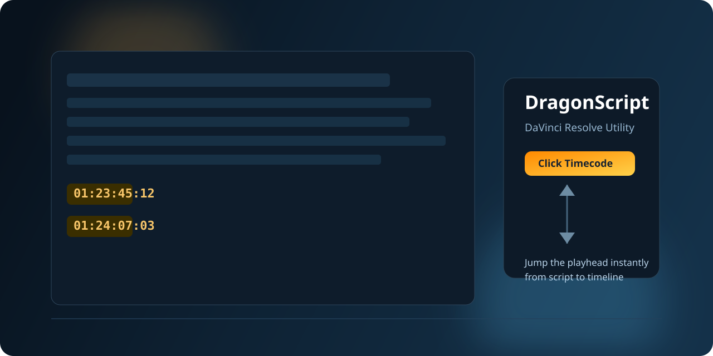

# DragonScript для DaVinci Resolve

[](https://www.lua.org/)
[](#установка-простой-способ)
[](#changelog)
[](#статус-проекта)
[](LICENSE)

[English version](README.md)



Читай сценарий прямо внутри DaVinci Resolve и переходи к нужному таймкоду одним кликом — не выходя из программы.

DragonScript — лёгкий Lua-скрипт для DaVinci Resolve / Fusion. Открывает текстовый документ в плавающей панели, подсвечивает SMPTE-таймкоды в тексте и переводит playhead при клике на таймкод в правом списке.

---

## Статус проекта

DragonScript v3.0 — финальный стабильный релиз проекта.

---

## Зачем это нужно

- **Не нужно переключаться** между Resolve и внешним редактором.
- **Боковая панель таймкодов** — все найденные TC в одном списке с контекстным превью.
- **Клик — прыжок** — кликни на таймкод в панели и playhead сразу на месте.
- **SET TC** — вставь текущую позицию Resolve прямо в текст одной кнопкой.
- **Кнопка Обновить** — вручную пересобирает правый столбец после правок текста.
- **Save As** — всегда экспортирует чистый `.txt`, в каком бы формате ни был источник.

---

## Возможности

| Функция | Подробнее |
|---|---|
| Форматы файлов | `.txt` `.fountain` `.md` `.srt` `.fdx` `.docx` `.doc` `.rtf` `.odt` `.pages` |
| SMPTE форматы | `HH:MM:SS:FF` и `HH:MM:SS;FF` (drop-frame) |
| Боковая панель | Список всех TC с до 7 слов контекста после каждого |
| Клик → прыжок | Кликни на TC в боковой панели — playhead переходит сразу |
| SET TC | Вставляет текущий таймкод таймлайна в позицию текстового курсора |
| Обновить | Пересобирает подсветку и правый столбец из текущего текста |
| Размер шрифта | Настраивается от 8 до 36 pt |
| Save As | Экспорт в `.txt` |

---

## Установка (простой способ)

1. Открой DaVinci Resolve → **Workspace** → **Console**.
2. В консоли **Lua** выполни:

```lua
print(fu:MapPath("Scripts:/Edit/"))
```

3. В Finder открой **Переход** → **Переход к папке...**, вставь этот путь, скопируй туда `DragonScript.lua`, перезапусти Resolve и запусти:

```text
Workspace → Scripts → Edit → DragonScript
```

Если скрипт не появился: включи Preferences → System → General → **External scripting using = Local**.

---

## Как использовать

### Открытие файла

1. Нажми **Open…** и выбери файл сценария или заметок.
2. SMPTE-таймкоды будут подсвечены оранжевым в тексте.
3. Все найденные таймкоды появятся в **правой боковой панели** с кратким контекстом.

### Переход playhead

- **Кликни на таймкод в боковой панели** — playhead мгновенно переходит на это место.

### Запись текущей позиции

- Нажми **SET TC**, чтобы вставить текущий таймкод таймлайна Resolve в позицию курсора в тексте.  
  После вставки нажми **Обновить**, чтобы обновить правый столбец.

### Обновление после правок

- После ручного редактирования текста нажми **Обновить**, чтобы пересобрать подсветку и правый столбец.

### Редактирование

- Нажми **Save As…** для экспорта текущего текста в `.txt`.

---

## Для кого

- Монтажёры, работающие со сценарием или заметками с таймкодами.
- Режиссёры и ассистенты, просматривающие производственные заметки.
- Script-supervisor workflow — всё в одной программе.

---

## Технически

- **Язык:** Lua 5.1 (Fusion scripting внутри DaVinci Resolve)
- **UI:** Fusion `UIManager` / `bmd.UIDispatcher`
- **Resolve API:** `Resolve()` → `GetCurrentTimeline()` → `SetCurrentTimecode()`
- **Платформа:** macOS и Windows (тестировалось на DaVinci Resolve 18 / 19)

---

## Changelog

- **3.0**
- Финальная версия интерфейса для рабочего использования
- Добавлена ручная кнопка **Обновить** для правого столбца
- Упрощён интерфейс (убраны Jump TC / Go)
- Стабилизировано сохранение через Save As в `.txt`

---

## Лицензия

Распространяется по лицензии MIT. См. файл [LICENSE](LICENSE).
